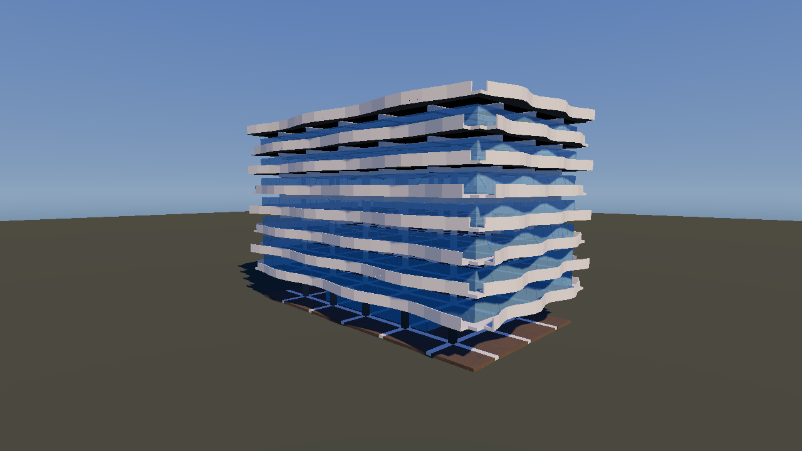

# Authored structures

Hand-designed buildings — an apartment block and two houses — rendered from
ScenePacks with per-material shading, including transparent glass.



## Where things live

The split follows ownership, not convenience.

| | Repo |
|---|---|
| Scene pack format, generators, validation | `blast-stress-solver-2/blast/blast-stress-solver/structures/` |
| Textures, viewer, screenshots, game integration | here |

`blast-stress-solver-2` owns `SCENE_PACK_FORMAT.md` and every piece of
authoring machinery — the Voronoi fracturer, the material tables, the
post-and-beam house model. Porting any of it here would have meant ~600
duplicated lines and a fourth copy of a material table that has already drifted
three ways in that repo. What only exists here is the realistic look: the
triplanar shader, the Poly Haven texture arrays, the PMREM sky, and the
Playwright capture tooling.

## Generating

```bash
cd /root/workspace/blast-stress-solver-2/blast/blast-stress-solver
node structures/build.mjs --emit-vibe-land /root/workspace/vibe-land-2
```

Packs land in `destruction/assets/scenes/`. They are v2 and load in the game via
`VIBE_CITY_SCENE=algedra-tower.json`, though the game's own renderer still
shades every chunk through one material — see *Not yet in the game* below.

Every pack is verified before it is written (interpenetration by GJK, grounding,
rest statics, load path), so a structure that would not stand up is not
produced. `destruction/tests/authored_structures.rs` covers the other half: that
what the generator emits is what the Rust parser and manifest builder accept.

## Looking at them

```bash
cd client && npm run dev
node tools/structure-shot.mjs algedra-tower
node tools/structure-shot.mjs algedra-tower --angles street,detail --port 6007
```

Writes `docs/structures/<pack>/{front,corner,street,aerial,detail,back}.png`.
Poses are derived from each structure's own bounds, so the same names frame a
10 m house and a 46 m block equally well.

The viewer is `/structure?pack=<name>` (`client/src/pages/StructureViewer.tsx`).
It reads the pack JSON straight from `destruction/assets/scenes` through vite's
`/@fs` — no server, no PhysX, no manifest hash — which is what makes the
regenerate-and-look loop a few seconds long.

Two things it does that the city path cannot:

- **Groups nodes by material.** The city shades every chunk through one
  material and gets per-building variety by hashing a building id into the
  texture array. An authored structure knows its pieces are brick or stone or
  steel, and looks the texture layer up by name (`materialKey` in
  `cityTextureSets.generated.ts`).
- **Renders glass.** There is no transparency anywhere in the destructible
  pipeline; the only glass in the game is a decorative vehicle window. Here
  glass is a separate `MeshPhysicalMaterial` drawn after the opaques.

One subtlety worth knowing before editing the viewer: the triplanar shader
reads its texture layer from a `cityAnchor` attribute, but *only* on its
instanced and batched branches. A plain `Mesh` takes the third branch, which
hardcodes layer 0 — so every material silently renders as cracked concrete.
Each merged material group is therefore an `InstancedMesh` of count 1.

## Textures

`client/scripts/build-city-textures.py` gained brick, stone, metal and white
plaster sets (`npm run textures:city`). Two constraints the file documents and
that bit during this work:

- **Wall layer order feeds the building-id hash.** New wall sets are appended at
  the end of the wall block; inserting ahead of an existing one would reshuffle
  which concrete every `/city` building wears. Adding them at all still changes
  `WALL_LAYER_COUNT`, so `/city` buildings *do* get reassigned textures — a
  cosmetic change, not a regression.
- **Masonry is directional.** The shader rotates tiles stochastically to break
  repetition, which turns horizontal brick courses vertical halfway up a wall.
  Brick, stone and metal all set `directional=True`; the first render without it
  had coursing running diagonally in patches.

## In the game

Serve any of them as the destructible city:

```bash
cd client && npm run build            # Caddy reads dist from disk
VIBE_CITY_SCENE=neighbourhood.json VIBE_CITY_GRID=1 ./scripts/run-city-server.sh
node client/tools/city-structures-shot.mjs   # photographs them in the live city
```

`neighbourhood.json` is all three merged into one scene — the tower at the
origin with a house either side. The city builder replicates ONE pack across a
grid rather than composing different ones, so "all three together" has to be a
pack of its own; `structures/neighbourhood.mjs` merges them, which is only
possible because they share a material table and their indices therefore carry
over untouched.

What was wired through to get there:

1. `destruction/src/scene_pack.rs` parses `nodes[].m` and the appearance fields.
2. `destruction/src/manifest.rs` carries `ChunkDef::material` and a
   `materialAppearance` table, both guarded with `skip_serializing_if`.
   `existing_packs_gain_no_manifest_fields` asserts the guards hold: the
   manifest is content-addressed, so an unguarded field would invalidate every
   client's cached copy.
3. `client/src/scene/cityChunkMesh.ts` groups chunks by transparency and gives
   glazing its own material. Only transparency splits a batch — which brick or
   concrete an opaque chunk wears travels per instance in the texture anchor,
   so every opaque material still shares one material and one batch.

### Brittle is not the same as weak

The first in-game run tore itself apart: 4,537 of 18,219 bonds broke before
anyone shot anything, and a house flattened itself. The cause was glass authored
at 4 MPa — five times weaker than the flimsiest material in any shipped pack —
on the reasoning that glass is fragile. Fragility is the *band* (`fatal /
elastic` = 1.05, so it snaps rather than yields), and that is independent of raw
strength; glass is enormously strong in compression. At 60 MPa with the same
band it is still brittle, and the scene now spawns with **zero** broken bonds.

The static check in `verify.mjs` had passed this at 55% throughout, which is
exactly its documented limit: it models load at rest, not the settling
transients a real solver produces. Nothing catches that but running it.

## Bond areas come from NvBlast, not from the builder

The builder decides *which* pieces are bonded in closed form — a shared Voronoi
edge, a shared cell boundary, a separating-axis test with a shadow overlap. It no
longer decides *how big* those bonds are. After a pack is built,
`structures/lib/autobond.mjs` re-measures every contact with NvBlast's own
`bondsFromPrefractured` (ExtAuthoring, EXACT mode, through the WASM build) and
takes the generator's area.

The reason is a bias the two methods disagree about, and only in one direction.
Checked pair by pair, the typical bond already agreed exactly — the median
pack/auto ratio was 1.00x in every joint class. What did not agree was the tail:
on the tower, 22% of bonds sat over a 2% tolerance, with a 95th percentile of
2.3x on beam-to-slab and 3.4x on balcony-to-slab, and **4,352 overstated against
42 understated**. The cause is the shadow overlap, which projects a *whole* shard
onto the contact plane, so two pieces touching over part of their outlines are
credited with the overlap of their silhouettes.

Overstatement is the direction that matters. Bond area is the denominator of
stress *and* the bond's damage pool, so a bond claimed bigger than it is reports
less stress than it carries and does not break when it should — the exact
failure mode behind "the core stays in one piece". Re-measuring removed 5-9% of
total bond area (Petronas 36,111 -> 32,813 m², with 27,439 individual bonds
shrunk).

Two things the generator is deliberately *not* trusted with:

- **Which pairs are bonded.** EXACT mode searches for a common *surface* and does
  not reliably find exactly-coplanar faces between independently triangulated
  meshes — which is most bearings in a building. It misses 6-9% of the pack's
  bonds that way (14,430 in Petronas), and they are load paths: a column on a
  slab, a parapet on a deck. Those are kept, and checked for a real gap instead;
  a pair the generator cannot see *and* that is more than a millimetre apart is
  dropped.
- **Areas larger than the pieces.** The generator can report several contact
  patches per pair, and summing them can exceed what the two pieces could
  possibly share. Unclamped this put 12 bonds in the skyline over the smaller
  chunk's own largest cross-section, which `verify.mjs` rejects outright. The
  measurement is clamped to that bound.

`structures/verify-autobonds.mjs` is the standing cross-check — it re-runs the
generator against a built pack and classifies every bond:

```bash
node structures/verify-autobonds.mjs \
  /root/workspace/vibe-land-2/destruction/assets/scenes/petronas.json
```

All nine packs now report **0 bonds across a real gap** and **0 overstated**, and
it exits non-zero if a bond ever spans one. `--no-autobond` on `build.mjs`
restores the closed-form areas for comparison.

## Identical panels shatter identically

A building is a handful of panel types stamped over and over — 432 Park's 2,443
panels are **34 distinct classes**. The renderer is built to exploit that: it
instances shards city-wide on geometric identity, and `chunkGeometry.ts` says so
outright ("deduplicating on this turns thousands of hulls into hundreds of
uploads"). It even hashes hull points to find the sharing when a pack does not
declare it.

The first version of these packs got **1.0x** out of that — 56,394 hulls, 56,289
distinct shapes. Every panel drew its Voronoi jitter from one builder-wide RNG
stream, so two identical windows on two identical floors shattered differently
and shared nothing.

`ScenePackBuilder` now seeds the jitter on the panel's own class instead: its
outline translated to its own origin, its thickness, its shard count. Identical
panels produce byte-identical shards. `SHAPE_VARIANTS = 3` patterns per class
keeps a facade from reading as tiled — the counter cycles per class, so the
three alternate up a wall.

`buildShapeLibrary()` then moves every shape used more than once into
`scenario.shapeLibrary` and points at it with `{"kind":"shape","shape":N}`,
which `scene_pack.rs` resolves at parse. One-of-a-kind shards stay inline, which
is what the format intends.

| | hulls | distinct shapes | reuse |
|---|---|---|---|
| 432 Park | 19,701 | 666 | **29.6x** |
| parking garage | 3,350 | 357 | 9.4x |
| Algedra | 7,922 | 1,785 | 4.4x |
| Petronas | 23,474 | 6,527 | 3.6x |
| skyline | 56,406 | 10,525 | 5.4x |

Petronas gains least: its lobed plan makes most panels genuinely one-of-a-kind.
432 Park gains most, because a square tube of uniform windows is the case this
is for.

`skyline.json` went **66.2 MB -> 38.3 MB** on the wire, and the distinct
geometry behind 56,583 chunks from 73.5 MB to 13.7 MB. Not one chunk was
removed and not one bond changed, so destructibility is untouched — the four
PhysX tests pass unchanged.

### What it costs in draw calls

Sharing is not free at the other end. A shape used often enough becomes its own
city-wide `InstancedMesh`, and the cutoff is `DEFAULT_INSTANCE_SHARE_THRESHOLD`
(8). At that setting the skyline went from 63 draws to **807**, and the geometry
actually uploaded is 34.3 MB rather than the 13.7 MB ideal, because a shape used
fewer than 8 times still gets copied into each cell's batch.

The curve, for the skyline:

| threshold | instanced meshes | geometry uploaded |
|---|---|---|
| 4 | 4,676 | 16.4 MB |
| **8** (default) | 799 | 34.3 MB |
| 16 | 420 | 39.2 MB |
| 32 | 330 | 41.7 MB |
| 256 | 0 | 73.3 MB |

Where the optimum sits is a device question, not a scene question, and
`renderQuality.ts` is emphatic about it: the default has already been flipped
once by measuring on the wrong hardware, and Metal punishes sub-draws in the
opposite direction from a 4090. It is live-settable so `perfSweep` can price it
on the device that is actually near budget. Do not pick it from a workstation.

### Known gap

The balcony bands read grey-concrete in game rather than the crisp white of the
reference. The base colour multiplies the sampled albedo, so it can only darken,
and the palest wall texture available is a mid-tone plaster. Fixing it properly
means baking a genuinely white surface into the array; the standalone viewer
sidesteps it by leaving that material untextured, which the city path cannot do
because every opaque chunk shares one material.
