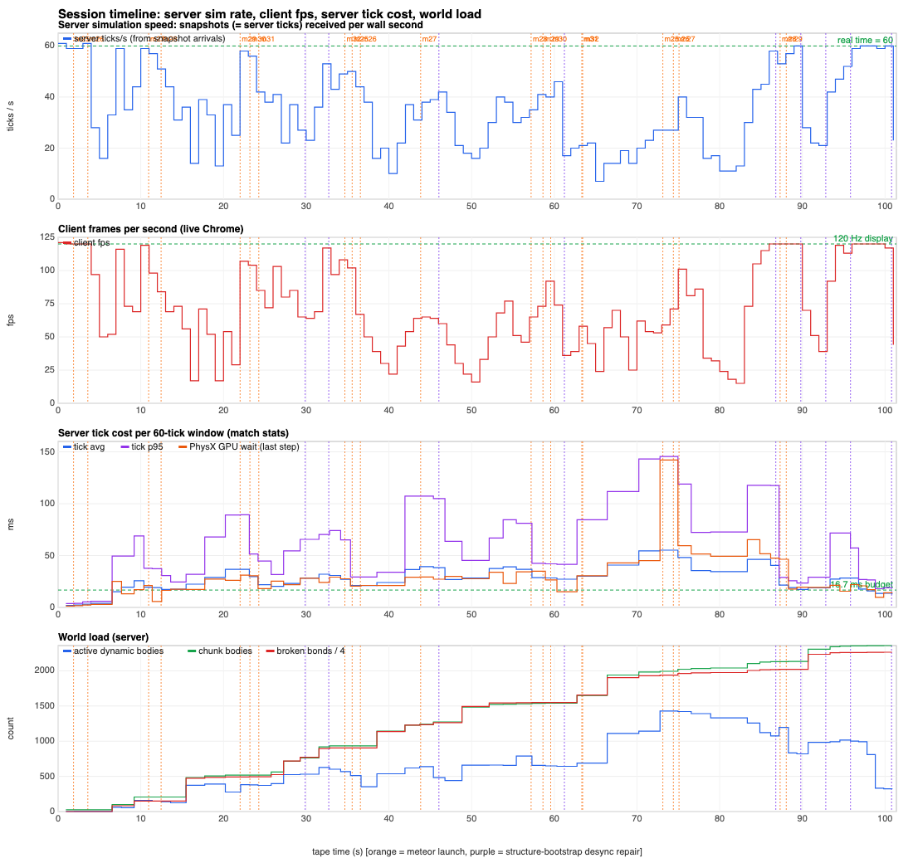
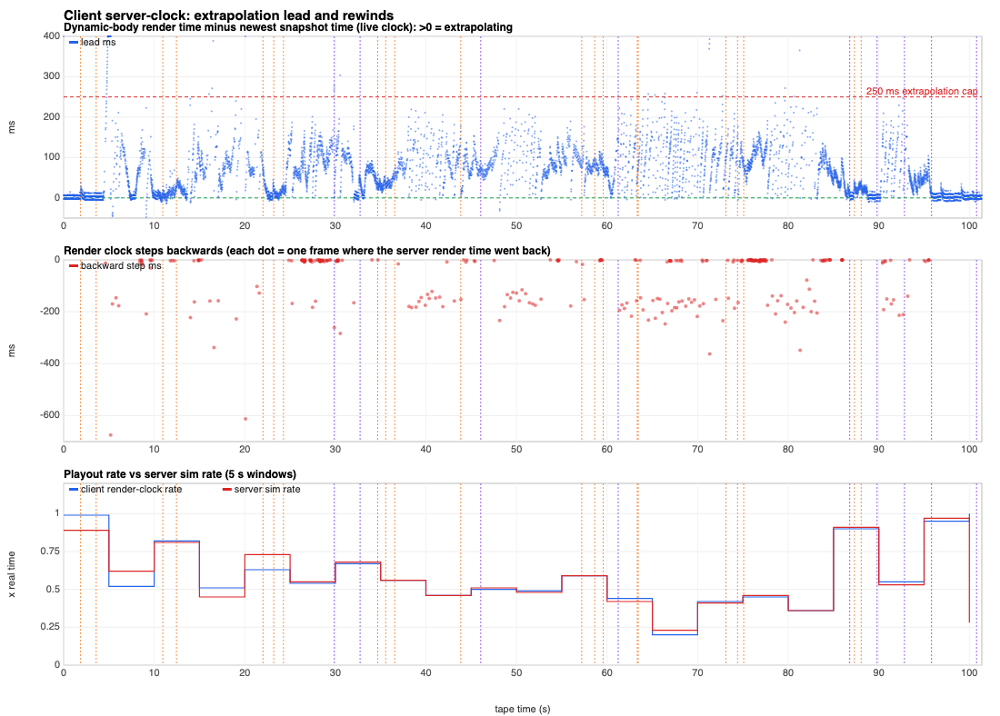
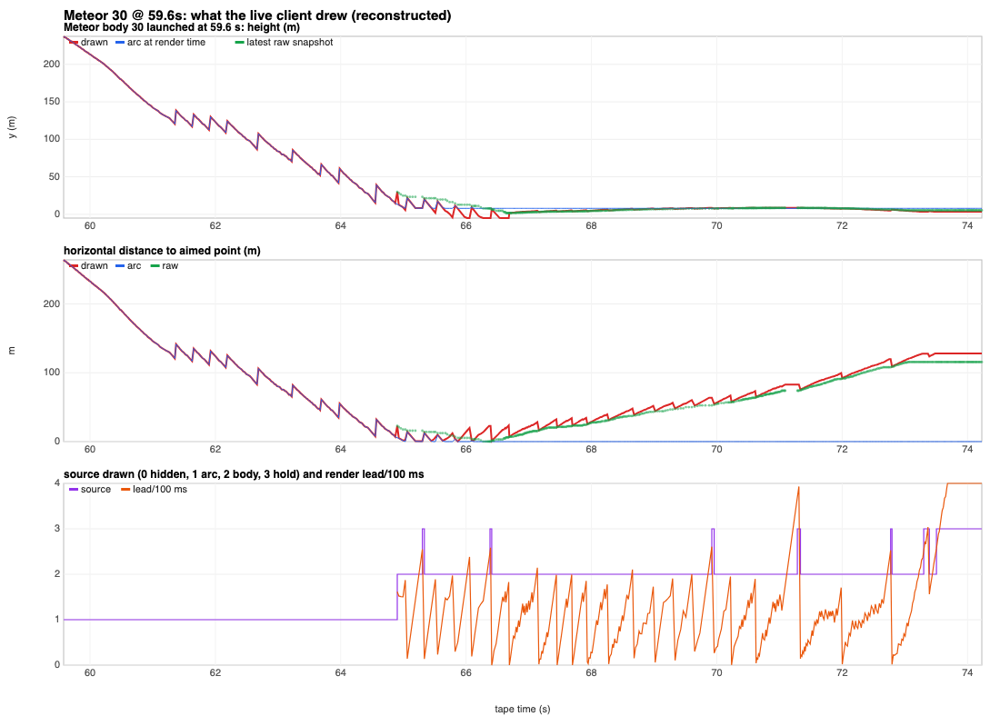

# Mac/Metal play session analysis, 2026-09-24

One 101.4 s play session on the M3 Max, with the PhysX GPU server and the
Chrome client on the same machine. The owner reported two symptoms:

- **Meteors rewind.** Trajectories were not smooth; meteors jumped back and
  rubber-banded.
- **Slow motion.** As destruction accumulated, everything became slow-motion
  and jittery.

The tape explains both. The server simulated at 0.59x real time because a
PhysX GPU step took 13–55 ms (60-tick window means), against a 16.7 ms
budget. That is the slow motion. The client's server-clock estimator assumes
server time advances at wall-clock rate. It ran ahead of the slowed server,
extrapolated up to 250 ms, then hard-reset backwards: 297 times, 20.5 s in
total. That is the rewinding. The server's own meteor motion is clean.

The session also showed four smaller problems: debris falling through the
ground, structure state diverging with no packet loss, client CPU spikes when
fracture starts, and match stats on the ordered reliable stream. The ranked
[to-do list](#to-do-ranked-by-impact) is at the end, followed by
[how to reproduce](#reproduce).

Labels used in this document: **measured** means read from the tape, the
server's match stats (carried on the tape) or the server log. **Inferred**
means a conclusion drawn from correlations or timing, not observed directly.

## Setup and data

| Item | Value |
|---|---|
| Machine | M3 Max; server and client on the same GPU |
| Server | vibe-land release build, commit `36e54a94` (match-stats fingerprint), `target/play/release/web-fps-server`, `VIBE_PHYSICS_BACKEND=physx_gpu`, `cuda_stress=false` |
| Physics | PhysX GPU through CuMetal/Metal: PhysX `07dbb8c9`, cuda-metal `26251a2` package |
| CuMetal env | `CUMETAL_USE_METAL_DEVICE_ADDRESSES` on. Its startup warning says it "removes cross-stream concurrency" |
| Client | Chrome 153, WebTransport (datagrams + reliable stream), same machine |
| City | 16 structures, 3,258 chunks, 10,373 bonds |
| Tape | `debug-reports/tape-1790237324-city-default/city.vltape`: client-only VLTAPE02, captured 2026-09-24T08:08:43.986Z, 101.4 s, 15,056 packets, 8.2 MB, 7,226 frames with per-frame clock data. The paired server capture did not exist yet |
| Server log | `target/mac-server-play.log` (gitignored run output) |
| Analysis output | `target/tape-analysis/` (gitignored). All numbers below come from `summary.json`, its CSV tables or the server log |

Times are **tape seconds**: 0 = 08:07:02.613 UTC, which is `capturedAt` minus the duration.

## Session timeline



*Panels, top to bottom: server ticks per wall second, client fps, server tick
cost, world load. Orange lines mark meteor launches; purple lines mark
structure-repair bootstraps.*

Measured:

- **Movement.** The player was on foot throughout. They walked from
  (−63, 0) east to x ≈ +30 (around 60 s), via z ≈ −38, and back to
  (−54, 19). Median ground speed was 6.0 m/s in simulation time. They were
  moving in 92% of snapshots.
- **Meteors.** The player fired 21 meteor shots and nothing else. Launches
  were at 1.9, 3.6, 10.9, 12.5, 22.0, 23.2, 24.3, 34.7, 35.6, 36.6, 43.8,
  57.2, 58.6, 59.6, 63.3, 63.4, 73.1, 74.4, 75.1, 87.3 and 88.1 s.
- **Destruction.** The server logged 645 `city stress fracture` events in the
  tape window. Broken bonds went from 0 to 9,056 (87% of 10,373). Chunk
  bodies went from 26 to 2,358. Active dynamic bodies peaked at 1,429
  (72.8 s window).
- **Quiet periods.** The server ran near 60 Hz at 0–4, 85–90 and 95–101 s.

## Finding 1: meteors rewind because of the client clock

The server slows down. The client clock does not model that, so meteors jump
backwards on screen. The server's meteor trajectory itself is clean.



### The render clock steps backwards (measured)

- **Server time on the wire is `tick × 16.67 ms`.** When ticks take longer
  than 16.7 ms, server time runs slower than wall time: 59.5 s of simulation
  in 101.4 s.
- **The estimator assumes rate 1.0.** `netcode/src/clock_sync.rs` smooths the
  offset and hard-snaps when the error exceeds 10 ticks (167 ms). Against a
  server running at 0.23–0.97x, the estimate drifts ahead until it snaps back.
- **Size of the rewinds.** The dynamic-body render time stepped backwards 297
  times, −20.5 s in total. 106 steps exceeded 100 ms. The worst were −675 ms
  at 5.2 s, −613 ms at 20.1 s, −363 ms at 71.3 s, −349 ms at 81.3 s and
  −338 ms at 16.6 s.
- **Every meteor rewound.** All 21 meteors moved backwards on screen, in 982
  frames. The largest single-frame jump was 93 m: meteor 26 on its arc at
  5.19 s, during the −675 ms snap. The next largest was 49 m (meteor 28 at
  12.5 s); later flights peaked at 10–35 m.
- **The launch arc rewinds too.** 477 of the 982 backward frames came while
  the meteor was drawn from its launch arc alone. The arc is evaluated at
  the render time, so it has no network samples involved.
- **The clock alone is enough.** 4 meteors never streamed a body (36.6, 63.3,
  63.4, 75.1 s) and still rewound. Only the clock can cause that.

### Interpolation delay collapsed, so the client almost always extrapolates (measured)

- **The delay is at its floor.** The adaptive delay was 5.0 ms for dynamic
  bodies and 8.33 ms for players for the whole session. Loopback jitter is
  about 0, so `jitter × 4 + 5 ms` stays at the floor.
- **Snapshots arrive much more slowly than that.** The gap between arrivals
  was 21.4 ms median, 46.9 ms p90, 142.9 ms p99 and 557 ms max. 78 gaps
  exceeded 100 ms.
- **Extrapolation is the normal case.** 90.7% of frames rendered dynamic
  bodies past the newest snapshot. The lead was 49 ms median, 131 ms p90 and
  251 ms p99; 21% of frames were more than 100 ms ahead.
- **The extrapolation is linear.** `client/src/net/interpolation.ts`
  extrapolates with velocity for up to 250 ms. When the next snapshot
  arrives the body snaps back.
- **Meteors are drawn underground after impact.** The server had them above
  ground, but 228 body-sourced frames across 17 flights drew them below
  y = 0, down to y = −19.8 m.

### The arc-to-body handover jumps (measured)

A meteor is drawn on its arc at render time. When its body first streams, a
body with a single sample is drawn at that sample's server time, because one
sample cannot be extrapolated. The jump is therefore about the lead before
the handover × speed.

- There were 17 handovers. The jump was 7.8 m median and 24.3 m max.
- **Largest (24.3 m):** meteor 26 at 78.8 s. A −158 ms clock snap landed on
  the handover frame; the lead before it was 180 ms.
- **Clearest example (22.1 m):** meteor 30 at 64.9 s, with 162 ms lead ×
  147 m/s.

### The stale rule holds, then jumps (measured)

`MeteorLayer` treats a body sample older than 250 ms as stale. The age is
measured against the client's server-time estimate. During server stalls the
meteor is then held in place and jumps when samples resume. There were 35
hold→body jumps, up to 33 m.

### The server's meteor motion is clean (measured)

- **Positions match velocity.** Consecutive server positions agree with
  integrating the reported velocity: p50 2 mm, p99 0.08 m (trapezoidal
  integration), max 1.26 m at impact.
- **The flight follows the arc.** In flight, server positions are 0.14–0.41 m
  from the launch arc at the same server time (450 samples).
- **Flights take longer on the wall clock.** Planned flights took 1.1–3.4x
  their planned time on the wall clock, median 1.7x. Meteor 30 (59.6 s) was
  planned at 2.57 s and took 6.7 s from launch tick to landing tick.



*Red is drawn, blue is the arc at render time, green is the newest server
sample. The sawtooth after 65 s is extrapolation followed by snap-back.*

## Finding 2: slow motion is the server tick (PhysX GPU step)

### The whole game ran slow (measured)

- **Snapshot rate.** Snapshots arrived at 35.2 Hz on average: one per tick,
  tick deltas all 1, none lost.
- **Simulation speed.** Game time ran at 0.587x real time. In 5 s windows it
  ranged from 0.23x (65–70 s) to 0.97x (95–100 s).
- **The client followed the server.** The client's render-clock rate matched
  the server rate window by window, so the client did not stretch time.
- **The server log agrees.** Match-health ticks per wall second were 40.6,
  36.5, 30.5, 26.4 and 33.4 over the tape, then 58–60 when quiet.

### The tick is PhysX GPU time (measured)

- **Over budget almost everywhere.** The mean tick exceeded 16.7 ms in 50 of
  59 match-stats windows. The other 9 were the quiet start (4 windows), the
  last 4 windows, and the window containing the first impact (mean 15.1 ms,
  but a 646 ms max).
- **Size of the tick.** Once destruction started, window means were 12.6–
  55.2 ms (median 28.2 ms). Window p95 reached 145 ms. The worst single tick
  was 646 ms, in the window at the first meteor impact (about 5 s).
- **Where the time goes.** 98.4% of tick time is the dynamics step. City
  encode, stream and fracture bookkeeping peak at 0.98 ms per tick.
- **GPU wait.** The last-step PhysX GPU wait samples were 5.7–142 ms (median
  25 ms) once destruction started.

### The tick scales with active bodies (measured fit, inferred cause)

- **Fit.** The tick is about 14.9 ms + 0.0197 ms × active dynamic bodies
  (r = 0.67). At the observed peak of about 1,430 active bodies the tick was
  55 ms, above the fit's 43 ms.
- **Weaker correlates.** Correlation is weaker with broken bonds (r = 0.36)
  and chunk bodies (r = 0.35). Awake bodies matter more than accumulated
  rubble.
- **The baseline does not match the benches.** The ~15 ms intercept is far
  above the bench measurements in
  [mac-metal-performance-2026-09-23](mac-metal-performance-2026-09-23.md):
  idle 1.8 ms paced, and 5–7 ms with 100–370 rubble bodies awake.
  - Candidate 1 (unproven): `CUMETAL_USE_METAL_DEVICE_ADDRESSES`, which
    serialises streams.
  - Candidate 2 (inferred): the client rendering on the same GPU.
- **It stayed slow after the tape.** For about 55 s after the tape, with only
  16–51 bodies awake, the server ran at 42.6–59.5 ticks/s (08:08:47–08:10:18
  UTC). After that it held a steady 60.

### The player's own motion stuttered (measured, thresholds matter)

The camera was compared with the server's player speed. These numbers come
from an ad-hoc pass in the analysis run that was not saved as a script, and
they depend on thresholds.

| Measure | Result |
|---|---|
| Camera frozen while the player moved | 6.7% of frames. A 5 mm/frame threshold reproduces 6.2% |
| Of those, frames > 100 ms ahead of the newest snapshot | 81–85% |
| Frames that jumped > 3x the expected distance | 205 in the original pass; 316–372 depending on definition |
| Frames that reversed direction | 274 in the original pass; 500–770 depending on definition |

The server hit its input cap (`MAX_INPUT_FRAMES_PER_TICK` = 8 input frames
applied in one tick) in 31 of 59 windows. Window p95 was 8 at 70–75 s. At
66.4 s, 12 inputs were pending. The player's inputs are applied in bursts,
because the server consumes a backlog when a slow tick finishes.

## Finding 3: the client renders slower while sharing the GPU (inferred)

- **Live frame rate (measured).** The live client averaged 71.3 fps. Frame
  times were 10.4 / 23.3 / 51.2 ms (p50/p90/p99) against main-thread CPU of
  2.1 / 3.7 / 5.5 ms. 22.8% of frames exceeded 16.7 ms.
- **It follows the server.** Per-second client fps correlates with server
  ticks per second (r = 0.90), not with awake chunks (r = −0.20).
- **Long frames with idle CPU line up with server stalls.** There are runs
  of ~93 ms frames at 2–3 ms CPU at 16.0–16.7 s, 21.2–21.4 s and
  82.0–83.1 s. The 428 ms frame at 20.05 s falls in the match-stats window
  whose worst tick was 514 ms.
- **Replay without a server (measured).** The same tape and recorded camera
  were replayed in headless Chromium (ANGLE/Metal, 1512×945 @2x) with no
  server running:

  | | Live (server on the same GPU) | Server-less replay |
  |---|---|---|
  | Average fps | 71.3 | 113.4 |
  | Frame p50 / p90 / p99 | 10.4 / 23.3 / 51.2 ms | 8.3 / 9.1 / 18.4 ms |
  | Frames > 16.7 ms | 22.8% | 2.1% |
  | Worst 5 s windows | 43 fps (15–20 s), 44 (45–50 s), 45 (65–70 s) | 92 fps (15–20 s), 87 (80–85 s) |

  The replay's fps also correlates with the live server tick rate (r = 0.49).
  The heaviest scenes cost the renderer too, but far less than the live gap.
  The replay decodes and renders everything the live client did. Decode cost
  is not on the tape, but the replay shows it fits within 113 fps.

## Finding 4: the network is not the limit (measured)

- **Bandwidth.** Inbound averaged 648 kbps, peaking at 1.83 Mbps.
- **By stream:**

  | Stream | Size |
  |---|---|
  | City chunks (datagrams) | 6.12 MB |
  | Match stats | 889 kB |
  | Baselines | 608 kB |
  | Snapshots | 291 kB |
  | Topology | 222 kB |
  | Structure repairs | 48 kB |
  | Energy | 18 kB |

- **Chunk sends.** 1,651 chunk sends (one per sent tick) had median size
  3,063 B. 75 (4.5%) hit the 10,400-byte per-send cap, at 65–75 s and around
  90 s.
- **Sends follow ticks.** Chunk sends per second follow the tick rate:
  30/s when the server is at 60 Hz, 4–13/s in the slowest windows (65–70 s,
  80–82 s).
- **No loss.** There were 0 datagram sequence gaps and 0 topology sequence
  gaps.

## Other problems found

### (a) Debris and meteors fall through the ground (measured)

- **14 chunk bodies went below y = −3 m.**
  - They crossed −3 m moving down at 7.8–9.8 m/s; two crossed at 19.7 and
    28.5 m/s.
  - These are slow crossings, not high-speed tunnelling.
  - They kept streaming as they fell, reaching as low as −337 m.
- **The server log has 15 "left the world" lines.**
  - 14 are these bodies, logged at y ≈ −999 m at 140–160 m/s, aged 706–898
    ticks. That is about 14 s of free fall from ground level
    (√(2·1000/9.81) = 14.3 s, 140 m/s).
  - The 15th left sideways at z ≈ +1000 m at 39 m/s.
  - The velocity-explosion counter stayed 0, so these were not explosions.
  - The bodies stayed awake and simulated until the 1 km bound. The kill
    floor `VIBE_CITY_NATIVE_DEBRIS_FLOOR_M` in
    `physx-bridge/src/native_observation.cc` is disabled (−∞) unless set.
- **Two meteor balls also sank through the ground on the server.**
  - Meteor 25 (launched 1.9 s) went below −1 m at 20.9 s and was at −47.9 m,
    falling at 31 m/s, when it stopped streaming (24.1 s).
  - Meteor 28 (launched 87.3 s) went below −1 m at 99.9 s and was at −23 m
    at the end of the tape.
  - Both had been on the ground for a while first: meteor 25 for about
    15 s, meteor 28 for about 9.5 s.

### (b) Structure state diverged nine times with zero loss (measured)

- **Repairs.** The server sent targeted structure-bootstrap repairs at 29.9,
  32.7, 46.1, 61.2, 86.8, 89.8, 92.8, 95.8 and 100.8 s. They covered
  structures 8, 9+13, 0, 5, 7, 7, 11, 3+9 and 13: 48 kB in total. Match
  stats count 9 desync repairs.
- **No gaps.** There were no datagram or topology sequence gaps, and every
  snapshot tick was consecutive.
- **Inferred cause.** Divergence without loss points to a client/server
  bookkeeping bug in topology or promotion handling, not the network.

### (c) Client CPU spikes at fracture onset (measured)

- **Spikes.** CPU-bound frames of 50–118 ms occurred at 4.6, 5.3, 9.1,
  48.1 and 90.4 s (plus 5.4, 9.6 and 90.7 s).
- **Timing.** Each coincides with a fracture starting.
- **Inferred cause.** One-time setup cost on first use.

### (d) Match stats and energy crowd the ordered reliable stream (measured)

- **Match stats are large.** Each match-stats packet is about 15 kB of JSON,
  sent once per 60 ticks: 59 packets, 889 kB. That is 10.8% of all inbound
  bytes, more than topology and repairs combined (270 kB).
- **It shares a stream with topology.** It is on the same ordered reliable
  stream, so a 15 kB write can delay the topology behind it (inferred).
- **Energy is sent every tick.** The local-player energy packet went reliably
  every tick: 3,570 messages, 68% of reliable-stream messages. The value
  changes every tick, and `maybe_send_local_player_energy_update` sends on
  any change.

## To-do (ranked by impact)

Items are checked off by whoever lands the fix. Each needs a tape (preferably
paired) showing the acceptance criterion.

- [ ] **1. Server physics: tick < 16.7 ms p95 at ~1,500 active bodies with a
  client rendering on the same GPU.**
  - *Layer / owner:* server physics; PhysX fork and cuda-metal (also being
    worked in those repos).
  - *Do:*
    - Profile PhysX GPU wait with and without
      `CUMETAL_USE_METAL_DEVICE_ADDRESSES`.
    - Explain the ~15 ms intercept against the 1.8 ms paced idle bench.
    - Confirm GPU contention with a paired capture: server GPU timeline plus
      client GPU timer, with the client on and off.
  - *Accept:* tick p95 < 16.7 ms in every 60-tick window of a session like
    this one, and server rate ≥ 59 ticks/s.
  - *Evidence:*
    - 50 of 59 windows over budget.
    - The tick is 98.4% dynamics.
    - Fit: 14.9 ms + 0.0197 ms per active body.
    - Client fps vs server rate r = 0.90.
    - Replay without a server: 113 fps; live: 71 fps.
- [x] **2. Client clock: model the server-time rate.**
  - *Done (2026-09-24):* `netcode/src/clock_sync.rs` estimates the rate
    (from the item 4 wall stamps, else arrivals), never advances past the
    newest snapshot by more than one interval, and slews; `RenderClock`
    never steps back. Replayed through the new code
    (`scripts/perf/tape-analysis/replay-clock.ts`): 296 → 0 backward steps,
    playout rate equal to the server rate in every 5 s window. Live bench
    (quick, 3 clients): 269–283 → 0 per client.
  - *Layer / owner:* client netcode, `netcode/src/clock_sync.rs`.
  - *Do:*
    - Estimate the server-time rate instead of assuming 1.0.
    - Slew instead of hard-snapping.
    - Never let render time go backwards.
  - *Accept:* 0 backward render-clock steps on this tape replayed through
    the new estimator (`meteors.ts` computes this). Playout rate still
    tracks the server rate.
  - *Evidence:* 297 backward steps, −20.5 s in total, up to −675 ms. 4
    meteors that never streamed a body still rewound.
- [x] **3. Client interpolation and meteor drawing.**
  - *Done (2026-09-24):* the delay is the p95 of sim time between arrivals,
    at least one snapshot interval, at most 250 ms; meteor placement is one
    function (`client/src/vfx/meteorPlacement.ts`) used by the layer and the
    tools; ballistic extrapolation for bodies in free fall; staleness in
    server ticks. On this tape: extrapolating 90.7% → 0%, meteors moving
    backwards 21 → 0, hold jumps 35 → 0, below-ground frames 215 → 0. The
    arc→body frame-to-frame step is 1.1 m median / 2.2 m max, over the 1 m
    criterion, because it includes one frame of flight at 150 m/s; the gap
    to the arc at the same render time (the actual discontinuity) is
    0.29 m median / 0.45 m max. Cost: body delay 5 ms → ~20 ms on loopback.
  - *Layer / owner:* client, `client/src/net/netcodeClient.ts`,
    `client/src/net/interpolation.ts`, `client/src/vfx/MeteorLayer.tsx`.
  - *Do:*
    - Keep the body delay ≥ one observed snapshot interval; don't trust ~0
      loopback jitter.
    - Extrapolate single-sample meteor bodies so the handover doesn't jump.
    - Use gravity-aware meteor extrapolation, or keep the arc until contact.
    - Base the stale rule on server ticks, not the estimated wall clock.
  - *Accept:* on this tape, arc→body jumps < 1 m, hold→body jumps < 2 m, no
    meteor drawn below ground while its server sample is above, and
    extrapolating frames < 10%.
  - *Evidence:*
    - Delay floor 5 ms against 21/47/143 ms snapshot gaps.
    - 90.7% of frames extrapolating.
    - Handover jump median 7.8 m, max 24.3 m.
    - 35 hold jumps up to 33 m.
    - Drawn down to y = −19.8 m.
- [x] **4. Server stream: let clients tell slow motion from network delay.**
  - *Done (2026-09-24):* SnapshotV2 carries a 4-byte trailer with the
    server's wall clock (µs mod 2^32), detected by length so older clients
    are unaffected; `PROTOCOL_VERSION` unchanged. Sim rate from the stamps
    vs the server tick log over 120 one-second windows: 0.0006% median,
    0.023% max error.
  - *Layer / owner:* server stream and protocol (`server/src/main.rs`,
    `shared/src`).
  - *Do:* send a wall-clock server time alongside the tick, or a "simulation
    running slow" rate signal.
  - *Accept:* the client can compute the sim rate within 5% per second
    without inferring it from arrival times.
  - *Evidence:* sim rate 0.23–0.97x in 5 s windows; the client could only
    see ticks.
- [ ] **5. Server physics: debris and meteors tunnel through the ground.**
  - *Layer / owner:* server physics and native destruction.
  - *Do:*
    - Find why resting bodies sink at 8–10 m/s.
    - Retire escaped bodies at a floor near the ground, not at 1 km.
    - Log the first below-ground tick with the body's contact state.
  - *Accept:* 0 bodies below y = −3 m in a session like this one.
  - *Evidence:* 14 chunk bodies and 2 meteor balls went below ground; 14
    "left the world" lines at y ≈ −999 m after about 14 s of free fall.
- [ ] **6. Destruction sync: find why structure state diverges with zero loss.**
  - *Layer / owner:* server city encoder and client topology.
  - *Do:*
    - Capture per-structure hashes per update; the paired capture can carry
      them.
    - Diff client and server at the first divergent update.
  - *Accept:* 0 structure-bootstrap repairs in a lossless session.
  - *Evidence:* 9 repairs (48 kB) with 0 datagram, topology or snapshot gaps.
- [ ] **7. Server stream: move match stats off the ordered reliable stream,
  and stop sending energy reliably every tick.**
  - *Layer / owner:* server stream (`server/src/main.rs`).
  - *Do:*
    - Move match stats to their own stream, or compress them, or send them
      less often.
    - Rate-limit or quantise energy.
  - *Accept:* match stats < 2% of bytes and not ahead of topology on the
    same ordered stream; energy messages ≤ 10/s.
  - *Evidence:* 889 kB (10.8%) of match stats; 3,570 energy messages.
- [ ] **8. Client: pre-warm what fracture onset builds on first use.**
  - *Layer / owner:* client city and destruction rendering.
  - *Do:* profile the 50–118 ms CPU frames; build those resources at load.
  - *Accept:* no CPU-bound frame > 33 ms at the first fracture of a session.
  - *Evidence:* CPU-bound frames at 4.6, 5.3, 9.1, 48.1 and 90.4 s.

### Transport policy

The WebSocket fallback is to be disabled: WebTransport only, unless
explicitly enabled. This is being implemented separately. This session was
WebTransport throughout: the tape header says `webtransport`, and the log
shows `websocket_players=0` and `datagram_fallbacks=0`.

## Next data: paired capture

Commit `c65aa1e4` makes RECORD TAPE also record the server into
`debug-reports/session-<id>/`: client tape, send log, per-tick world truth
and clock samples. Inspect a bundle with `scripts/perf/session_bundle.py`.
The next paired recording of a session like this one should confirm:

- **GPU contention (item 1).** Server tick and GPU wait from the tick log,
  against the client's GPU timer and frame times on one clock.
- **Server tick vs client clock (items 2 and 4).** Each received packet
  joined to its send record gives true send time and latency. That separates
  server stalls from the client clock running ahead.
- **Ground contact (item 5).** World truth per tick shows the first tick a
  body is below ground. It needs the contact state added to the capture.
- **Structure hashes (item 6).** Once per-structure hashes are added per
  update, the first divergent update and structure.
- **Input bursts.** Send-to-apply time for inputs during slow ticks.

The [city bench](city-bench.md) (`scripts/perf/city-bench.sh`) produces such
a paired recording repeatably: scripted headless players destroy the whole
city building by building, and its report measures every symptom above
(server tick and sim-rate, client frames, render-clock rewinds, extrapolation
lead, meteor handovers, repairs without loss, match-stats and energy
traffic, bodies below ground) against budgets taken from the to-do list's
acceptance criteria, per phase and against destruction level. Use it to
accept or reject each to-do item, and `--baseline` to compare runs.

## Reproduce

The scripts are in `scripts/perf/tape-analysis/`; see its `README.md`. In
short, from `client/`:

```bash
TAPE=../debug-reports/tape-1790237324-city-default/city.vltape
OUT=../target/tape-analysis
npx tsx ../scripts/perf/tape-analysis/decode.ts    $TAPE $OUT
npx tsx ../scripts/perf/tape-analysis/dumpstats.ts $TAPE $OUT/match_stats.json
npx tsx ../scripts/perf/tape-analysis/meteors.ts   $TAPE $OUT
npx tsx ../scripts/perf/tape-analysis/below.ts     $TAPE
cd .. && python3 scripts/perf/tape-analysis/analyse.py target/tape-analysis target/mac-server-play.log \
  --meteors 30@59.57,31@63.33,25@73.13
```

- **Outputs.** Everything is written to `target/tape-analysis/`
  (gitignored). The charts in this document were rendered from its
  `timeline.svg`, `render_clock.svg` and `meteor_30_59s.svg`.
- **Reproducibility.** Re-running on this tape reproduces `summary.json`
  exactly, except `server_log_health`, which grows with the server log.
- **The replay uses the GPU** (`run-replay-perf.sh` under
  `scripts/perf/gpu-run.sh`, no game server running). Caveats for the
  numbers above:
  - Headless Chromium at 1512×945 @2x, ANGLE/Metal. The dynamic resolution
    scale stayed 1.
  - Dust and other settings were the replay defaults, not necessarily the
    live client's.
  - A cargo build ran concurrently during the replay, so it is if anything
    pessimistic.
  - The replay's GPU timer values (p50 20 ms) are not consistent with its
    8.3 ms frames and were not used.
- **Manifest.** The replay used the manifest saved by an earlier recorder
  run (`target/tape-replay/run1/manifest-391bacd0….bin`), which has the
  same hash as the tape.

## Corrections to the first report

The first report of this analysis had some figures that the data does not
support. The figures in this document are the corrected ones:

| First report | Data |
|---|---|
| Walked at ~7 m/s | Median 6.0 m/s (simulation time) |
| Meteors moved back up to 35 m in one frame | Up to 93 m (meteor 26 at 5.19 s, on the arc during the −675 ms snap). Later flights peaked at 10–35 m |
| Largest handover 24 m was meteor 30 at 64.9 s | Largest was 24.3 m, meteor 26 at 78.8 s (clock snap on the handover frame). Meteor 30 at 64.9 s was 22.1 m, the clearest lead × speed case |
| Meteors drawn below ground to y ≈ −3 m | Down to −19.8 m by extrapolation. Two meteor balls also sank to −23 and −48 m on the server |
| Meteor 30 took ~5.4 s against 2.57 s planned | 6.7 s from launch tick to landing tick. About 5.3 s was launch to the first body sample |
| 5 s sim-rate windows 0.23x to 0.89x | 0.23x to 0.97x |
| 16 "left the world" lines | 15. 14 fell through the ground; 1 left sideways at z ≈ +1000 m |
| After the tape, 16 bodies awake, 42–55 Hz for ~50 s | 42.6 Hz was with 42 awake. With 16 awake it was 47–59.5 Hz, until about 08:10:18 UTC |
| Match stats ≈ 1/s | Once per 60 ticks: 59 packets in 101 s |
| ~1,400 active bodies → ~55 ms from the fit | 55 ms is the observed window mean. The fit gives 43 ms |
| Server motion p99 0.12 m, 0.2–0.46 m from the arc | p99 0.08 m and 0.14–0.41 m with the saved method. The difference is the integration method; the conclusion is unchanged |
| Camera frozen 6.7%, 205 jumps, 274 reversals | Definition-sensitive; see the table in Finding 2 |
