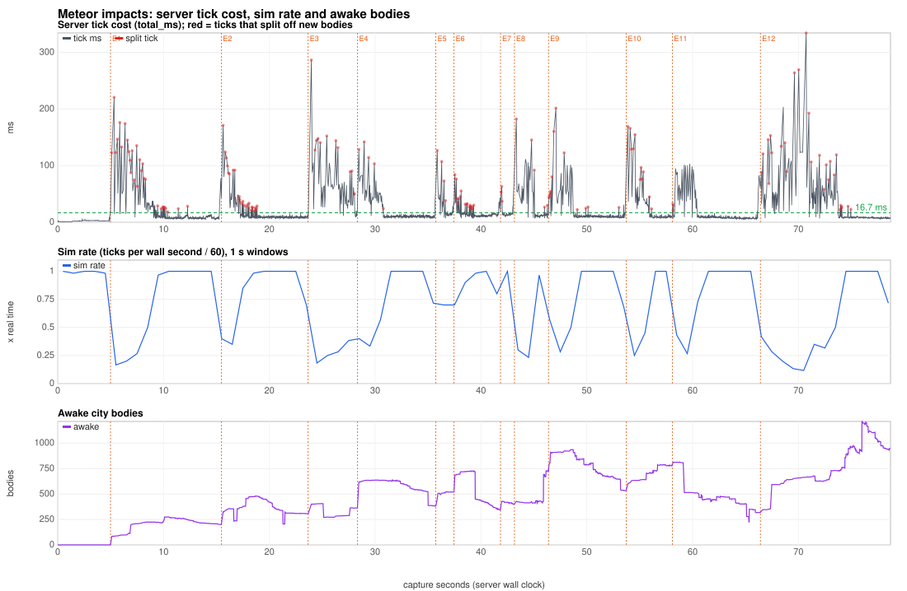
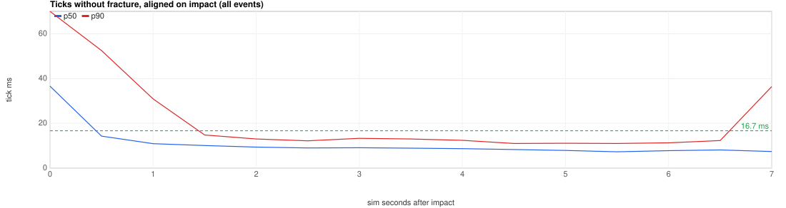
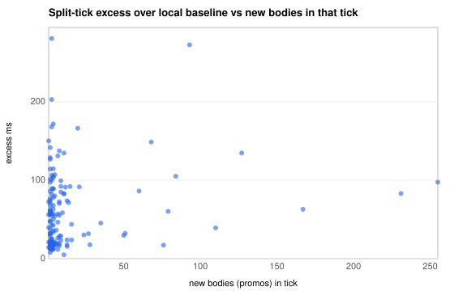
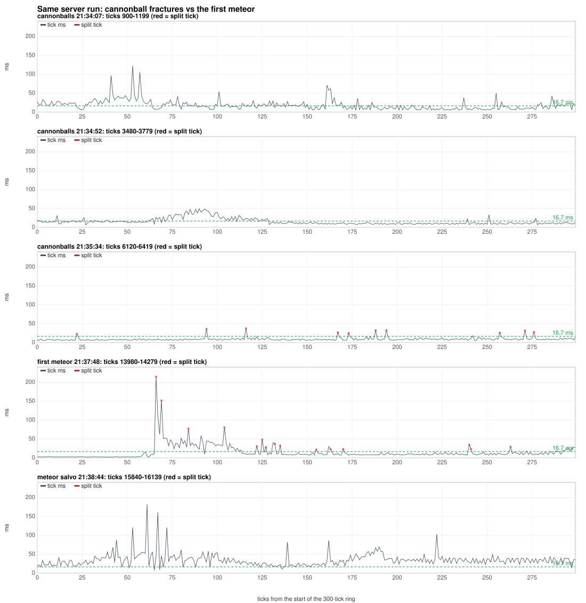
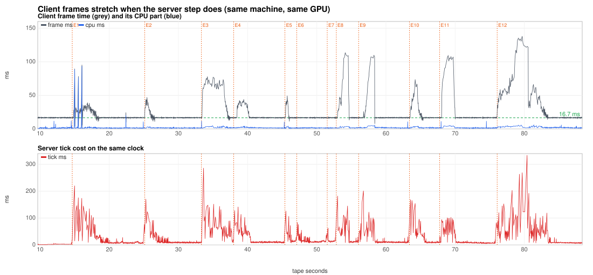

# Meteor impact analysis, 2026-09-24

The owner's play-test report on the 21:39 session:

> The performance is soooooo much better! Walking, driving, using cannonball
> is perfect! Now the only big performance issue I have is meteor impact
> destruction.

This analysis covers the paired capture of that session: 78.7 s of server
truth and the client tape, with 19 meteors and no cannonballs. It answers
what makes a meteor impact slow, how much each cause contributes, and who
owns each fix.

**Short answer.**

- **The server slows down.** Each meteor impact puts the server into slow
  motion for 1–8 s of wall time. In the first second after contact it runs
  at 0.13–0.37× real time.
- **Where the time goes.** Nearly all of the step cost is `dynamics_ms`,
  the PhysX GPU step with the native destruction stage inside it (97.9%).
  It comes from two sources of about equal size:
  1. **Every tick that splits off new bodies costs a roughly fixed extra
     40 ms (median) to 114 ms (p90).** How many bodies the tick creates
     barely matters. A meteor produces 3–20 such ticks in its first
     second. In the cannonball window compared, three shots and the
     collapse they started produced 10 split ticks in 5 s, at 23–38 ms
     each.
  2. **The ticks between the splits run at 25–45 ms for about 1 s of
     simulation.** After cannonballs, the same kind of tick runs at 8 ms.
     This cost tracks how far the undamped 110 t rock keeps ploughing
     through the city after contact: 26–127 m at 40–75 m/s. It does not
     track the bonds broken, the bodies created or the awake count.
- **The client stalls with the server.** The client frame rate drops to
  14–40 fps during the same windows. The client is not busy: 3 of 165 long
  frames were CPU-bound. The browser and the server share one GPU, and
  144 of the 165 long frames coincide with a server tick over 50 ms.
- **The netcode is not a factor.** There were no repairs, no topology gaps
  and no extrapolation. A structure repair rebuilds a structure's chunk
  state on the client.

**For the PhysX-fork owner: what is and is not known about the impact
ticks.**

- **Not known.** A per-stage breakdown inside the 100–330 ms ticks
  (broadphase, narrowphase, solver, stress, fracture and split, correction
  pass, host waits) needs the GPU run. That run is prepared but was
  [not run](#gpu-experiment-prepared-not-run): the permission policy
  refused it. This capture records `dynamics_ms` as one number, and 97.9%
  of tick time sits in it, inside `simulate()`/`fetchResults()` as GPU
  wait.
- **Known, and measured, at the level of tick classes:**
  - The 100–330 ms ticks are almost all **split ticks**, i.e. ticks that
    promote new bodies. 56 of the 73 ticks over 100 ms are split ticks.
    The other 17 are ticks in the first second after contact.
  - A split tick costs 39.6 ms (p50) and 114.4 ms (p90) above its
    neighbours, **nearly independent of the bonds broken or bodies
    created** (r = 0.22 and 0.20). A 1-bond, 2-body split cost 146 ms; a
    1,018-bond split cost 142 ms. The corrected re-solve and new-actor
    creation are the prime suspects (inferred).
  - The ticks between splits run at 25–45 ms for about 1 s after contact,
    at any awake count, tracking how far the rock ploughs on.
  - Per impact (first second): 32–1,018 bonds on the contact tick, 70–1,191
    bonds and 25–325 new bodies in total, and 3–20 split ticks. A
    cannonball window with three shots had 10 split ticks in 5 s, at
    23–38 ms.

The [ranked to-do list](#to-do-ranked-by-measured-contribution) is at the
end, followed by the [GPU experiment](#gpu-experiment-prepared-not-run) that
would pin down the split-tick cost, and [how to reproduce](#reproduce).

Labels used in this document:

- **Measured** means read from the capture, the server log, the debug
  reports or the tape.
- **Inferred** means a conclusion drawn from correlation or timing, not
  observed directly.

## Setup and data

| Item | Value |
|---|---|
| Machine | M3 Max. The server and the Chrome client ran on the same machine and GPU. |
| Server | `target/play/release/web-fps-server` with `VIBE_PHYSICS_BACKEND=physx_gpu` and `cuda_stress=false`. The capture fingerprint says git `ff84dec6`; the report named `28a7eb10`. `ff84dec6` changes only `server/src/perf_bench.rs`, which is test-only, so the runtime is the same (measured, `git diff --stat`). |
| Physics | PhysX `63a60440` with cuda-metal `02bb9ca`, from the shared install at `PhysX/out/install/macos-cumetal/release`. During this analysis, until 18:54 local, the install's `libcumetal.dylib` was dated 16:03 and had no `CUMETAL_TRACE_SYNC`, which is consistent with `02bb9ca`. At 18:54 the install was replaced with cuda-metal `780264d` + PhysX `63a60440`. Any GPU run from now on measures that newer package, not the session's. The log warns that `CUMETAL_USE_METAL_DEVICE_ADDRESSES` is on. |
| Destruction backend | Native. The stress solve, bond breaking, splitting, fragment creation and one corrected rigid re-solve per fracturing tick all run inside `scene->simulate()/fetchResults()`, so they are timed in `dynamics_ms` (`destruction/src/native_runtime.rs:1-20`, `physx-bridge/src/native_destruction.cc:25-44`). |
| City | 16 structures, 3,258 chunks, 10,373 bonds (manifest `391bacd0…`). The city was reset at 21:39:20 and was intact at the start of the capture. |
| Server capture | `debug-reports/session-20260924-213925-ondf3t/server/`. Ticks 18146–21521, 3,376 ticks in 78.71 s wall (21:39:25.98–21:40:44.69 UTC). Nothing dropped. |
| Client tape | The same bundle's `client.vltape`, byte-identical to `~/Downloads/city-2026-09-24T21-40-44-672Z.vltape` (SHA-1 `c6f7316b…`). VLCTAPE2, 88.35 s, 4,390 frames, 12,561 packets, WebTransport. |
| Server log | `target/play/server-20260924-182126.log`. The same server process ran from 21:30:44; its match started at 21:33:47. |
| Cannonball comparison | The same server process, 21:33:59–21:36:13: 169 cannonballs. One meteor opened that match at 21:33:51 (first fracture at tick 463, 563 bonds before the first cannonball); it is counted with the meteors below. The comparison uses the per-second log lines, the fracture lines and the 300-tick `tick_ring` in `debug-reports/report-17902856xx-…/server.json`. The 20 s client tapes beside those reports (`tape-1790285739`, `-784`, `-874`) supply new bodies per tick. |
| Outputs | `target/meteor-analysis/` (gitignored): `tape/`, `out/`, `netlab/`, `tape-<id>/`. Scripts are in `scripts/perf/tape-analysis/`. |

Times are **capture seconds** (0 = tick 18146, 21:39:25.98 UTC) unless marked
tape seconds. Tape seconds = capture seconds + 9.66.

## Session timeline



*Top: server tick cost; red dots mark ticks that created new bodies. Middle:
sim rate in 1 s windows. Bottom: awake city bodies. Orange lines mark
impact events E1–E12.*

Measured:

- **Shots.**
  - The player fired 22 meteor shots. 19 launched; 3 were "aimed at
    nothing".
  - There were no cannonballs (`balls_launched=0` on every shot-routing
    line).
  - 18 meteors made contact inside the capture. Meteor 30, launched at
    tick 21468, would land after the capture stopped.
- **Destruction.** Broken bonds went from 0 to 8,826 (85% of 10,373). Chunk
  bodies went from 26 to 2,281. Awake bodies peaked at 1,213.
- **Pace.** The server simulated 3,376 ticks in 78.71 s, a sim rate of
  0.715.
  - 22.44 s of simulation was lost against real time.
  - The 12 impact windows account for 21.74 s of it (97%).
- **Tick cost.** p50 9.5 ms, p95 61.8, p99 128.7, max 334.3.
  - `dynamics_ms` is 97.9% of all tick time.
  - `city_ms` never exceeded 5.3 ms, and `snapshot_ms` never exceeded
    0.09 ms.

## 1. Every meteor impact

A meteor's contact tick is the first tick whose velocity change is not
gravity alone (|Δv − gΔt| > 1 m/s). If the fracture shows up in the log up to
three ticks earlier, that tick is used instead. Positions and speeds come
from the server's own body samples on the tape (`meteor_raw.csv`).
Structures come from the topology batches of the contact ticks. "Speed
in" is the speed on the first tick of the contact, so a rock that hit
something massive first shows a low value. All measured.

| Meteor (body) | Launch tick | Contact tick | Contact point (x, y, z) | Structure hit | Speed in (m/s) | Speed after 5 / 60 ticks | Still moving in the stream after contact | Travel after contact |
|---|---|---|---|---|---|---|---|---|
| 28 | 18284 | 18445 | −6.5, 7.0, 49.2 | 13 | 142 | 70 / 36 | 2.35 s | 102 m |
| 29 | 18718 | 18891 | −20.1, 6.4, 20.2 | 9 | 141 | 53 / 49 | 1.42 s | 73 m |
| 30 | 19154 | 19307 | −37.7, 2.2, −7.2 | 4 | 144 | 55 / 41 | 1.75 s | 73 m |
| 31 | 19159 | 19319 | −36.7, 4.8, −9.1 | 4 | 147 | 51 / 49 | 1.43 s | 72 m |
| 32 | 19226 | 19391 | −39.5, 11.4, −37.2 | 0 (roof) | 39 (hard first contact with the 10.2 m roof) | 39 / 38 | 2.43 s | 92 m |
| 25 | 19232 | 19397 | −33.7, 3.2, −35.1 | 0, 4 | 137 | 77 / – | 0.98 s | 75 m |
| 26 | 19581 | 19732 | −5.3, 4.6, −41.8 | 1, 2 | 147 | 59 / – | 0.95 s | 55 m |
| 27 | 19634 | 19801 | 33.1, 6.5, −36.3 | 3 | 140 | 60 / – | 0.60 s | 35 m |
| 28 | 19640 | 19808 | 33.3, 8.5, −37.1 | 3 | 146 | 27 / 23 | 3.45 s | 82 m |
| 29 | 19887 | 20038 | 50.0, 5.5, −19.1 | 7 | 147 | 54 / – | 0.45 s | 26 m |
| 30 | 19949 | 20104 | 4.9, 1.3, −35.1 | 2 | 145 | 73 / 72 | 1.15 s | 82 m |
| 31 | 20041 | 20214 | 12.3, 10.4, −10.0 | 6 | 140 | 130 / 69 | 1.40 s | 100 m |
| 32 | 20393 | 20550 | 7.2, 6.6, 8.7 | 10 (and 6) | 147 | 64 / 61 | 1.25 s | 81 m |
| 25 | 20551 | 20720 | −1.5, 2.7, 6.8 | 9 (rubble beside it) | 145 | 58 / 52 | 1.83 s | 94 m |
| 26 | 20935 | 21113 | 22.0, 1.4, 35.9 | 14 | 147 | 55 / 29 | 3.85 s | 127 m |
| 27 | 20941 | 21124 | 23.2, 2.2, 34.2 | 14, 15 | 72 (hard first contact) | 72 / 70 | 1.70 s | 119 m |
| 28 | 20976 | 21127 | 34.2, 10.4, 47.3 | 15 | 147 | 130 / 46 | 1.53 s | 73 m |
| 29 | 20982 | 21150 | 34.8, 1.6, 37.6 | 15 (and 11, 14) | 51 (hard first contact) | 49 / 46 | 2.22 s | 99 m |

"Still moving in the stream" is how long the body stayed in the client's
stream after contact. When it left, it was still moving at 23–72 m/s
(measured). Body ids are reused from a pool of 8.

The rock is 2 m in radius and weighs 110,584 kg (3,300 kg/m³). It hits at
about 145 m/s:

- **Energy and momentum.** About 1.2 GJ and 1.6×10⁷ kg·m/s: 64× the
  cannonball's kinetic energy and 26× its momentum. The cannonball is
  10.65 t at 60 m/s (19 MJ).
- **Speed after contact.** It loses about half its speed in the first five
  ticks, then keeps rolling. It has no damping (`launch_dynamic_ball`
  zeroes both) and a 15 s TTL.

Constants are from `server/src/meteor.rs:47-59` and
`server/src/city.rs:168-202`. The speeds are measured; the energy ratio is
arithmetic.

Grouping impacts that land within 60 ticks of each other gives 12 impact
events. Four of them were salvos of 2–4 meteors aimed at the same spot.

| Event | Contact tick | t (s) | Meteors | Structures | Bonds, first 2 ticks | Bonds, first 1 s | Max bonds in one tick | New bodies, first 1 s | Split ticks, first 1 s | Awake before → peak |
|---|---|---|---|---|---|---|---|---|---|---|
| E1 | 18445 | 5.0 | 28 | 13 | 415 | 1,178 | 410 | 248 | 20 | 0 → 275 |
| E2 | 18891 | 15.5 | 29 | 9 | 777 | 966 | 775 | 201 | 14 | 200 → 480 |
| E3 | 19307 | 23.7 | 30, 31 | 4 | 442 | 523 | 442 | 125 | 9 | 306 → 405 |
| E4 | 19391 | 28.3 | 32, 25 | 0, 4 | 1,018 | 1,033 | 1,018 | 270 | 5 | 362 → 638 |
| E5 | 19732 | 35.7 | 26 | 1, 2 | 126 | 227 | 126 | 88 | 4 | 383 → 521 |
| E6 | 19801 | 37.5 | 27, 28 | 3, 7 | 835 | 1,028 | 835 | 217 | 10 | 519 → 728 |
| E7 | 20038 | 41.9 | 29 | 7 | 316 | 317 | 244 | 88 | 3 | 343 → 428 |
| E8 | 20104 | 43.2 | 30 | 2 | 37 | 70 | 37 | 25 | 3 | 403 → 730 |
| E9 | 20214 | 46.4 | 31 | 6 | 450 | 818 | 374 | 200 | 8 | 723 → 936 |
| E10 | 20550 | 53.7 | 32 | 6, 10 | 342 | 490 | 342 | 129 | 11 | 534 → 792 |
| E11 | 20720 | 58.1 | 25 | 9 | 32 | 84 | 41 | 28 | 3 | 792 → 813 |
| E12 | 21113 | 66.4 | 26, 27, 28, 29 | 9, 11, 14, 15 | 53 | 1,191 | 787 | 325 | 14 | 318 → 1,213 |

- **Bonds** come from the log's fracture lines.
- **New bodies** are topology promotions. Each is one new rigid actor
  (island).
- **Split ticks** are ticks that promoted at least one new body.

All measured.

## 2. Server cost per impact



| Event | Tick before (p50 ms) | Peak tick (ms) | Ticks > 50 / > 100 ms | Elevated, wall s | Elevated, sim s | Sim time lost (s) | Sim rate 0–1 s | Sim rate 1–5 s | Split tick p50 (ms) | Other ticks p50 (ms) | Excess: split / break-only / other (s) |
|---|---|---|---|---|---|---|---|---|---|---|---|
| E1 | 2.7 | 220.7 | 29 / 14 | 4.53 | 1.62 | 2.91 | 0.17 | 0.48 | 122.6 | 26.0 | 2.10 / 0.14 / 0.73 |
| E2 | 7.8 | 171.0 | 10 / 3 | 2.23 | 0.98 | 1.25 | 0.22 | 0.88 | 86.2 | 15.1 | 0.85 / 0.07 / 0.35 |
| E3 | 8.5 | 286.4 | 38 / 10 | 4.66 | 1.40 | 3.26 | 0.13 | (E4) | 140.6 | 36.3 | 1.32 / 0.20 / 1.74 |
| E4 | 31.5 | 142.0 | 17 / 4 | 2.79 | 1.15 | 1.64 | 0.22 | 0.78 | 114.4 | 35.7 | 0.43 / 0.00 / 1.24 |
| E5 | 10.3 | 126.8 | 4 / 2 | 1.71 | 1.15 | 0.56 | 0.48 | (E6) | 90.1 | 15.0 | 0.28 / 0.00 / 0.31 |
| E6 | 12.0 | 84.1 | 3 / 0 | 1.13 | 0.83 | 0.29 | 0.70 | (E7) | 43.8 | 15.6 | 0.28 / 0.02 / 0.04 |
| E7 | 11.8 | 86.8 | 3 / 0 | 1.31 | 1.10 | 0.21 | 0.90 | (E8) | 53.3 | 13.6 | 0.10 / 0.00 / 0.12 |
| E8 | 13.6 | 182.4 | 17 / 5 | 3.22 | 1.83 | 1.39 | 0.27 | (E9) | 92.1 | 12.5 | 0.39 / 0.00 / 1.04 |
| E9 | 12.7 | 201.7 | 22 / 5 | 2.78 | 1.12 | 1.66 | 0.28 | 0.76 | 54.5 | 18.1 | 0.63 / 0.00 / 1.06 |
| E10 | 9.0 | 169.0 | 11 / 5 | 2.57 | 1.03 | 1.53 | 0.17 | (E11) | 96.6 | 29.3 | 0.97 / 0.00 / 0.59 |
| E11 | 8.9 | 103.3 | 21 / 3 | 2.71 | 1.15 | 1.56 | 0.37 | 0.77 | 29.6 | 24.2 | 0.03 / 0.00 / 1.53 |
| E12 | 6.8 | 334.3 | 50 / 22 | 7.80 | 2.32 | 5.48 | 0.25 | 0.21 | 107.1 | 37.0 | 2.59 / 0.43 / 2.52 |

- **Elevated window.** From contact until the trailing 30-tick mean tick
  stays under 16.7 ms for 60 ticks, or until the next event.
- **Sim time lost.** Wall time minus simulated time over that window.
- **Excess.** The sum of (tick − 16.7 ms) over the window's ticks. It is
  split by tick class: ticks that created bodies, ticks that only broke
  bonds, and the other ticks.
- **"(E4)"** in the 1–5 s column means the next impact started inside that
  window.

All measured (`out/events.csv`).

### Where the capture's slow time went (measured)

The capture's total tick time above the 16.7 ms budget is 23.06 s:

| Tick class | Ticks | Excess over budget | Share |
|---|---|---|---|
| Ticks that created new bodies (split ticks) | 156 | 10.33 s | 45% |
| Ticks that broke bonds but created no bodies | 193 | 0.87 s | 4% |
| All other ticks | 3,027 | 11.85 s | 51% |

The "other" excess is not spread across the session. In the event-aligned
view:

| Ticks without fracture, by time after contact | p50 | p90 |
|---|---|---|
| 0–0.5 s of simulation | 36.6 ms | 70 ms |
| 0.5–1.0 s | 14.3 ms | 52.5 ms |
| 1.0–1.5 s | 10.9 ms | 30.9 ms |
| 1.5 s and later | 8–10 ms | 11–15 ms |

The elevated cost lasts about 1–1.5 s of simulation. At 0.13–0.37× real
time, that is 2–5 s of wall time for a single meteor and 7.8 s for the
four-meteor salvo.

### Split ticks: a roughly fixed cost per tick (measured, attribution inferred)



A split tick's excess is measured against the median of non-fracture ticks
within ±6 ticks of it. That excess has a p10 of 14.7 ms, a p50 of 39.6 ms
and a p90 of 114.4 ms. It hardly depends on how much the tick does:

| New bodies in the tick | Ticks | Excess p50 | Excess p90 |
|---|---|---|---|
| 1 | 6 | 48.0 ms | 111.3 ms |
| 2–4 | 91 | 31.5 ms | 106.3 ms |
| 5–19 | 40 | 50.3 ms | 100.2 ms |
| 20–399 | 19 | 63.0 ms | 152.3 ms |

The excess correlates only weakly with the tick's size:

| Against | r |
|---|---|
| New bodies | 0.20 |
| Chunks moved into new bodies | 0.23 |
| Bonds broken | 0.22 |
| Awake bodies | −0.21 |

Examples from E1:

- Tick 18450 broke 1 bond, created 2 bodies and cost 146 ms.
- Tick 18445 broke 410 bonds, created 84 bodies and cost 122 ms.
- Tick 18466 broke 393 bonds, created 79 bodies and cost 87 ms.

**Candidate "one huge fracture event" (refuted).** The largest single-tick
fracture, 1,018 bonds (E4, tick 19391), cost 142 ms, no more than a 1-bond
split.

**What the fixed part is (inferred).** Each fracturing tick runs one
corrected rigid re-solve (`VIBE_CITY_NATIVE_CORRECTION_LIMIT` = 1) and
creates new PhysX actors inside the GPU step. The debug reports count one
correction per fracturing tick: 16 corrections for 15 split ticks after
the first meteor of the run. The cost is GPU wait:
`physics_gpu_wait_ms` / `sim_wall_recent_ms` read 28–56 ms in the meteor
windows, against 9–15 ms in the cannonball windows. Which part of the step
it is cannot be decided from this capture. The
[GPU experiment](#gpu-experiment-prepared-not-run) splits it.

**First use (refuted for the server).** The first meteor of this server
process (21:37:48, tick 14046, city intact) cost 214.7 ms. The capture's
first meteor (E1) cost 220.7 ms. The ninth impact event's split ticks
(E12) still reached 334 ms. Minutes of cannonball fractures had already
run in the same process. First-use pipeline compilation would cost seconds
once, and no tick over 334 ms exists. (Measured.)

### Ticks between the splits: the rock keeps ploughing (measured correlation, inferred cause)

For about 1 s after contact, the ticks that neither split nor fracture run
at 25–45 ms. After a cannonball the same ticks run at 8 ms. The awake count
does not explain the difference:

| Awake city bodies | Non-fracture ticks | p50 | p90 |
|---|---|---|---|
| 0 | 299 | 2.3 ms | 3.2 ms |
| 150–299 | 470 | 8.4 ms | 32.3 ms |
| 300–499 | 1,048 | 9.6 ms | 15.7 ms |
| 500–799 | 972 | 10.9 ms | 39.5 ms |
| 800–1,999 | 383 | 8.6 ms | 19.7 ms |

Late in the capture, 1,100 awake bodies stepped at 8.9 ms (match stats at
tape 86.7 s). Over the capture, r(non-fracture tick ms, awake) = 0.14.

Across the 12 events, the median non-fracture tick in the first 60 ticks
correlates as follows:

| Against | r with the median non-fracture tick | r with sim time lost |
|---|---|---|
| **Meteor travel after contact** | **0.55** | **0.72** |
| Meteor time in the stream after contact | 0.47 | 0.57 |
| Peak ballistic (free-flight) debris records | 0.30 | 0.44 |
| New bodies in the first 1 s | 0.18 | 0.42 |
| Bonds in the first 1 s | 0.10 | 0.34 |
| Awake before impact | 0.02 | −0.25 |

- **E11** broke 84 bonds and created 28 bodies, yet its non-fracture ticks
  ran at 37 ms (p50) and it lost 1.56 s. The rock rolled 94 m through
  rubble.
- **E7** broke 317 bonds, but its rock stopped within 26 m. It lost 0.21 s.

Two more signals point the same way (measured):

- **Broadphase pair churn.** The GPU found/lost-pair high-water mark comes
  from the debug-report span `gpu_found_lost_pairs_high_water`.
  - It was 267 at 21:34:07, after the match's opening meteor and the
    first cannonballs. It reached 408 by the end of the cannonball
    session.
  - It rose to 724 with the first meteor after the 21:37:12 reset, and to
    1,099 during the meteor salvos.
  - It is not established whether the counter resets with the city, so
    the meteor figures are lower bounds on their own peaks.
- **Free-flying debris.** After a meteor contact, city sends carry 60–130
  ballistic (free-flight) body records, against 15–40 after a cannonball
  (the tape's `ballistic` counts).
  - Netlab scores the debris drawn position "now" at p99 8.7 m, behind by
    the ~28 ms interpolation delay. That implies ejecta at hundreds of m/s
    (inferred).
  - `docs/city-meteor-shot.md` records rocks ejecting settled chunks at
    km/s.

**Inferred cause.** The cost between splits comes from contact and
broadphase work around the undamped 110 t rock as it ploughs on at
40–75 m/s, and around the debris it throws. Found/lost pairs reach the
host through pinned-host drains under CuMetal; cuda-metal
`docs/known-gaps/runtime.md` reports that four of the ~10 blocking waits
per step are drains before `prepareLostFoundPairs_Stage2` and
`dmaBackChangedElems`. Which of the two, rock or debris, dominates is
to be settled by the experiment's `small` arm, and by a damped-meteor arm
once to-do item 1 adds the knob.

### Other candidates

- **Stress solver on a large, loaded structure (not meteor-specific).** The
  solver hits its 16-iteration cap and stays unconverged on about 94% of
  ticks after the first meteor (220 of 234). The cannonball session is
  similar: 84% (2,230 of 2,640 ticks between two reports). Both are
  measured from the report counters. At 1–1.5 ms per step (the profile
  facts), it cannot explain 25–45 ms ticks (inferred).
- **Corrected re-solves.** They happen on every fracturing tick and are
  part of the split-tick cost above. Their size is unmeasured; see the
  `nocorrect` arm.
- **Many fragments staying awake (refuted as the meteor problem).** The
  steady cost with 1,000+ awake bodies is 8–10 ms, and the sim rate is
  1.0. It is a separate idle-cost issue.
- **The approach.** Two to four ticks before contact the step rose to
  17–19 ms with 0 awake bodies (E1, ticks 18442–18444). This is small
  (measured).

### Cannonballs in the same server process (measured)



| | Cannonballs (21:33:59–21:36:13) | Meteors (21:37:45–21:40:44) |
|---|---|---|
| Shots | 169 | 29 launched |
| Bonds broken | 8,199 (≈49 per shot) | 14,224 (≈490 per meteor) |
| Fracture events ≥ 100 / ≥ 500 bonds | 24 / 0 of 1,078 (max 393) | 28 / 8 of 881 (max 1,018) |
| 300-tick ring after a fracture burst (21:35:34 vs first meteor 21:37:48) | 10 split ticks, 23–38 ms (p50 29.9); the next tick back to 6–15 ms; 11 ticks over budget; 0.13 s excess | 15 split ticks, p50 32.8 ms, max 214.7; 25–55 ms between them for ~50 ticks; 71 ticks over budget; 1.62 s excess |
| Non-fracture ticks p50 / p90 | 8.1 / 11.0 ms (236–579 awake) | 9.0 / 32.0 ms (0–163 awake) |
| GPU found/lost pairs high-water | 267–408 | 724–1,099 |

The cannonball session had its own slow patch: in its first minute the
300-tick ring at 21:34:07 had a p50 of 15.8 ms and spikes up to 123 ms.
That window follows the match's opening meteor (21:33:54, 563 bonds) by
about 12 s, and it is the closest the cannonball session came to meteor
numbers.
`match health` lines were not used for this comparison: each summarises
only a short recent window. For example, the 21:39:47 line reports a
13.2 ms max, although E2's 171 ms tick falls between it and the previous
line.

**What is different.**

- **Scale.** About 10× the bonds per shot. The largest single-tick break is
  2.6× bigger. The kinetic energy is 64× and the momentum 26×.
- **Structure.** Cannonball split ticks cost about 30 ms each (10 in 5 s
  for three shots), and the step returns to its baseline on the next
  tick. A meteor causes 3–20 split ticks in its first second, each
  50–140 ms (median per event).
  The ticks between them stay at 25–45 ms for about 1 s, while the rock
  keeps going for 26–127 m.

## 3. Client per impact



| Event | fps 3 s before | fps 0–2 s | Frame p95 / max (ms) | Frames > 50 / > 100 ms | CPU max (ms) | CPU-bound long frames | Snapshot gap max (ms) | Client-seen sim rate 0–2 s | fps 2–6 s |
|---|---|---|---|---|---|---|---|---|---|
| E1 | 60.0 | 39.0 | 35.6 / 95.4 | 3 / 0 | 93.8 | 3 | 264 | 0.19 | 51.5 |
| E2 | 60.0 | 47.0 | 40.1 / 47.2 | 0 / 0 | 3.3 | 0 | 173 | 0.38 | 60.0 |
| E3 | 60.0 | 16.5 | 76.3 / 78.0 | 27 / 0 | 11.9 | 0 | 293 | 0.19 | 34.8 |
| E4 | 30.7 | 35.0 | 41.1 / 44.1 | 0 / 0 | 4.3 | 0 | 144 | 0.29 | 58.8 |
| E5 | 60.0 | 53.0 | 37.6 / 49.4 | 0 / 0 | 3.8 | 0 | 115 | 0.64 | 60.0 |
| E6 | 55.0 | 60.5 | 17.5 / 17.6 | 0 / 0 | 2.3 | 0 | 81 | 0.82 | 59.2 |
| E7 | 60.0 | 52.0 | 36.6 / 47.1 | 0 / 0 | 3.9 | 0 | 187 | 0.65 | 40.5 |
| E8 | 60.0 | 24.5 | 109.1 / 113.7 | 11 / 7 | 3.9 | 0 | 187 | 0.30 | 43.8 |
| E9 | 36.7 | 35.5 | 93.9 / 107.2 | 9 / 3 | 5.0 | 0 | 200 | 0.28 | 56.0 |
| E10 | 60.0 | 33.5 | 63.0 / 73.7 | 9 / 0 | 3.9 | 0 | 173 | 0.27 | 43.5 |
| E11 | 58.3 | 17.5 | 107.0 / 109.1 | 18 / 10 | 11.4 | 0 | 126 | 0.31 | 58.0 |
| E12 | 59.7 | 19.0 | 64.7 / 75.9 | 25 / 0 | 4.7 | 0 | 147 | 0.31 | 13.8 |

All measured from the tape's per-frame records: rAF-to-rAF `frameMs` and
the JS `cpuMs`.

**Server-caused slowness.** The client plays the world at the server's pace.
Snapshots arrive at the slowed tick rate, with gaps up to 293 ms at the
impact tick. The client-seen sim rate in the 0–2 s window was 0.19–0.38 for
the heavy events. This is the slow motion. There were no rewinds:
`replay-clock.ts` reports 0 render-clock backward steps, 0% of frames
extrapolating, and 0 meteor backward frames. The tick-scale clock fix
works. (Measured.)

**Client frame rate.** Frame time rises to plateaus of 60–113 ms while the
server steps are long, but the CPU part of those frames stays at 2–6 ms
(measured):

- **Long frames.** The capture has 3,811 client frames, and 165 of them are
  longer than 50 ms. Only 3 were CPU-bound.
- **Server overlap.** 144 of the 165 overlap a server tick over 50 ms. Only
  8 long frames happened while the server tick was under 20 ms.
- **Correlation.** r(frame ms, overlapping server tick ms) = 0.61.

The client waits on the GPU it shares with the server's PhysX step
(inferred; the previous analysis's Finding 3 saw the same). It is a cost of
running both on one machine, and it disappears when the server step is
fixed.

**Client rendering cost.**

- **First impact after a reset (measured).** Three frames, at
  0.35/0.88/1.40 s after E1's contact, took 89.7, 78.4 and 95.4 ms, almost
  all CPU (88.6, 76.9, 93.8 ms). That is a 2 Hz cadence, and it never
  recurred at later impacts. This is a client first-use cost after the
  21:39:20 city reset and re-bootstrap (inferred). Candidates:
  - the pose and record texture re-upload or reallocation;
  - a shader relink when a material's uniform texture is swapped
    (`citySlotMesh.ts:79-96`);
  - bounding-sphere rebuilds per cell (`citySlotMesh.ts:331-353`).

  A Chrome performance profile of the first impact after a reset would
  name it.
- **Meteor arrival (measured).** Frames of 10.7–12.3 ms CPU appear
  0.1–0.3 s before five of the contacts. They fit inside a 16.7 ms frame.
- **Per-frame cost of the new bodies (measured).** The post-impact CPU p95
  is 3.5–5 ms, so new chunk bodies and pose-table writes are not the
  problem.

## 4. Netcode around impacts (measured)

- **Stream.** City sends went out every 2 ticks, against the static
  10,400 B allowance throughout.
  - The rate controller never limited the stream: every send's
    `allowance_bytes` was 10,400.
  - 30 of 1,538 sends reached ≥ 95% of the ceiling, 28 of them in E12's
    first 2 s. 237 records were cut by the ceiling.
  - The median bytes per send was about 400–3,200 in the 2 s before an
    impact and 1,800–9,800 in the 2 s after.
  - Datagram rates on the tape fell during the 0–2 s windows (e.g. E1:
    41.5 pkt/s, 25 kB/s) and rose afterwards (118–201 kB/s). The server
    sends per tick, so the rate follows the tick rate.
- **Tape totals.** City chunks 5.5 MB, peak 237 kB/s. The whole session
  averaged 562 kbit/s, with a 2.0 Mbit/s peak.
- **Netlab v2**, on the recorded link, replaying this bundle's frozen truth
  through the production encoders and client (CPU only, 8 s):
  - 12.4 M scored draw-frames. Position error at render time: p99
    0.066 m.
  - 119 missing draws (98 debris, 21 meteor) and 194 wrong-identity debris
    chunk-frames, out of 2.8 M debris draws. 0 stale body or meteor frames.
  - City sync: 0 repairs asked, 0 applied, 33 hash checks with 0
    mismatches, 0 topology gaps, 0 NACKs.
  - Render backsteps 0. Clock lag p50 −1.0 ms, p99 23.8 ms.
- **Verdict.** The netcode adds nothing to the slowness. Its only visible
  symptom, snapshot gaps, is the server tick.

## 5. Root causes, ranked by measured contribution

The ranking is by share of the 23.06 s of over-budget tick time, which is
what the player sees as slow motion. The client-frame symptom follows the
same windows.

| # | Cause | Contribution (measured) | Mechanism | Owner |
|---|---|---|---|---|
| 1 | Ticks between the splits run at 25–45 ms for about 1 s after contact | 11.85 s (51%). Most of it lies in the first 1 s of simulation after contact. | The undamped 110 t rock ploughs on for 26–127 m at 40–75 m/s, and the debris it throws adds contact and broadphase pair churn (inferred; r = 0.72 between travel and sim time lost; found/lost pairs 2.7× the cannonball high-water). | **vibe-land server** (meteor tuning: damping, TTL, embed after contact) for the quick win. **PhysX GPU and CuMetal** for the per-tick cost of pair churn. |
| 2 | Each split tick costs about 40 ms extra (p90 114), nearly independent of its size | 10.33 s (45%): 156 split ticks | A fixed per-split cost inside the GPU step: the corrected re-solve, new actor creation and its host waits (inferred; the experiment splits it). Meteors multiply it: 3–20 split ticks in the first second of an impact, against 10 in 5 s for a three-shot cannonball burst. | **PhysX/Blast GPU** (split and correction path) and **CuMetal** (host waits). **vibe-land bridge** (`native_destruction.cc`) could coalesce promotions. |
| 3 | Salvos: 2–4 meteors on one spot within 0.1–0.6 s | E3, E4, E6 and E12 lost 3.26 + 1.64 + 0.29 + 5.48 = 10.67 s, 49% of the sim time lost in impact windows; E12 alone 5.48 s | Overlapping impacts stack both costs. | **vibe-land server** (shot cadence). |
| 4 | The client frame rate drops while the server steps are long | 144 of 165 long frames; fps 14–40 in the 0–2 s windows | Shared GPU (inferred). | Fixed by 1–2. There is no client-side fix. |
| 5 | Client first-use CPU cost | 3 frames, 260 ms CPU, once per reset | Unknown client work at 2 Hz after the first split (inferred). | **vibe-land client rendering.** |
| 6 | Bond-break-only ticks | 0.87 s (4%) | | Covered by 2. |
| – | Netcode | 0 | | **Netcode**: no action. |
| – | Stress solver unconverged at 16/16 iterations | Not meteor-specific (94% vs 84% of ticks) | Costs 1–1.5 ms per step (profile facts). | PhysX/Blast, as part of the general step cost. |
| – | Server first-use pipelines | Refuted | | |
| – | Awake-body count | Refuted for meteors (r = 0.14) | | The rubble-sleep work covers the idle cost. |

## To-do (ranked by measured contribution)

1. **Take the energy out of the rock after contact.** Owner: vibe-land
   server (`server/src/meteor.rs`, `physx_runtime.rs`
   `launch_body`/`expire_launched_balls`).
   - **Target of cause 1 (51%).** Today the rock has 0/0 damping and a
     900-tick TTL, and it leaves each contact at 40–75 m/s.
   - **Options, cheapest first:**
     - linear and angular damping switched on at first contact;
     - retire or "embed" the meteor N ticks after its first contact, or
       once it has lost X% of its speed;
     - a shorter TTL (`VIBE_CITY_METEOR_TTL_TICKS`) as a stop-gap.
   - **Measure first.** The rock rolling through the city is part of the
     spectacle, so this is a product decision. Measure with the
     experiment's `small` arm first. Once this item adds a damping knob,
     add a damped arm and measure that too, before choosing.
   - **Acceptance.** On a paired capture with a meteor pattern like this
     one (or the perf_bench `meteor` scenario):
     - the meteor is under 5 m/s within 1 s of first contact;
     - the median non-fracture tick in the first 1 s after contact is
       ≤ 16.7 ms, down from 25–45;
     - sim time lost per single meteor is ≤ 0.5 s, down from 0.2–3.3 s.

2. **Find and cut the fixed cost of a split tick.** Owners: the PhysX-fork
   owner (PhysX/Blast GPU split and correction path) and CuMetal (host
   waits in that path).
   - **Target of cause 2 (45%).** Run the prepared
     [GPU experiment](#gpu-experiment-prepared-not-run) first. Its
     `zones` arm names the engine zones of each split tick; `commits`
     shows the command buffers and GPU idle gaps; `nocorrect` prices the
     corrected re-solve.
   - **Acceptance.** In perf_bench `meteor`:
     - split-tick excess over neighbouring ticks p50 ≤ 5 ms and p90
       ≤ 15 ms, down from 39.6 and 114.4 ms;
     - `fracture_warm` split ticks under 16.7 ms.

3. **Coalesce promotions so that one impact makes fewer split ticks.**
   Owner: vibe-land bridge (`physx-bridge/src/native_destruction.cc`, stage
   settings) with the PhysX-fork owner.
   - Meteors split on 3–20 ticks in their first second, each paying the
     fixed cost. Batching new actors (at most one promotion tick per N
     ticks, or deferring small islands) multiplies any gain from item 2.
   - **Acceptance.** For the same bonds broken, split ticks in the first
     second after a meteor contact are ≤ 4, down from a p50 of 8.5, with no
     visible pop (netlab `chunk_debris` pos@render p99 unchanged).

4. **Rate-limit meteor salvos.** Owner: vibe-land server (shot routing).
   - Cause 3: the four salvos lost 10.7 s of simulation, E12 alone 5.5 s.
   - Options: a per-shooter cooldown of 1–2 s, or merging shots aimed
     within a few metres of a live meteor's target.
   - **Acceptance.** No two meteor contacts from one shooter less than 60
     ticks apart; E12-like 7.8 s windows do not occur.

5. **Put the stage's per-tick phases in `ticks.jsonl`.** Owner: vibe-land
   server telemetry.
   - The capture could not say where inside `dynamics_ms` a split tick
     goes. Add: correction passes, new actors, found/lost pairs, GPU wait,
     host-wait count and time, and stress iterations.
   - Also fix two gaps the survey found:
     - a player-fired meteor launch lands in `unattributed_ms`
       (`route_city_shots`);
     - `snapshot_ms` is stale on non-snapshot ticks.
   - **Acceptance.** The next paired capture attributes ≥ 90% of each split
     tick's `dynamics_ms` to named phases.
   - **Status (2026-09-24).** Implemented: `ticks.jsonl` `timing_version` 2
     (see [city-bench.md, Tick phases](city-bench.md#tick-phases)), with
     `shots_ms` and a per-tick `snapshot_ms`. The stage's own phase times
     need `VIBE_PHYSX_PROFILE=1` on the play server. The stage reports no
     host-wait count; CuMetal's `CUMETAL_TRACE_SYNC` remains the source for
     that.

6. **Profile the first impact after a city reset in the client.** Owner:
   vibe-land client rendering.
   - Three frames of 77–94 ms CPU at 2 Hz after E1 (cause 5).
   - **Acceptance.** No frame with CPU > 33 ms at the first impact after a
     reset.

7. **Separate the shared-GPU effect from client cost in play tests.** Owner:
   vibe-land client and play-test tooling.
   - Record the client's GPU timer on the tape. `startGpuFrame` already
     collects it, but `frameMs`/`cpuMs` alone cannot show GPU wait.
   - Optionally, re-run one meteor test with the server on another
     machine.
   - **Acceptance.** Tape frames carry `gpuMs`, and long frames can be
     classified as CPU, GPU or wait.
   - **Status (2026-09-24).** Implemented: 68-byte tape frames carry the
     frame's GPU time (`frames.gpu`, NaN where there is none; header
     `gpuTimer`), and `report.py` / `meteor_impacts.py` classify long frames
     as cpu / gpu / wait / unknown.

8. **Netcode: no action.** Watch the city ceiling in salvos: 28 of the 30
   near-ceiling sends were in E12.

## GPU experiment (prepared, not run)

The play server was down and the lock was free. A background request to run
the prepared GPU experiment was refused by this session's permission policy,
so nothing below has been run. Every number in this document is from the
CPU-only analysis.

What is prepared:

- **Scenario.** A `meteor` perf_bench scenario (in this patch,
  `server/src/perf_bench.rs`) replays the session's first two meteors from
  their logged start and velocity:
  - meteor 28 at structure 13, then meteor 29 at structure 9 434 ticks
    later, as live;
  - it measures every tick from the first launch to 600 ticks after the
    second contact.
- **Runner.** `scripts/perf/tape-analysis/meteor-bench.sh` runs the arms
  under the machine-wide lock.
- **Binary.** The test binary is built:
  `target/meteor-analysis/cargo/release/deps/web_fps_server-c88140cb4ccdc8ac`
  (worktree at `ff84dec6` plus this patch, PhysX package `63a60440`, CPU
  build only).

```bash
# once (CPU only; already done in this worktree):
cd /Users/glavin/Development/vibe-land/.claude/worktrees/meteor-analysis
CARGO_TARGET_DIR=/Users/glavin/Development/vibe-land/target/meteor-analysis/cargo \
PHYSX_ROOT=/Users/glavin/Development/PhysX/out/install/macos-cumetal/release \
  cargo test -p web-fps-server --release --no-default-features --features native-destruction perf_bench --no-run

# the GPU run (takes /Users/glavin/Development/vibe-land/scripts/perf/gpu-run.sh; run from bash, not zsh `&`):
bash -c 'BENCH_BIN=/Users/glavin/Development/vibe-land/target/meteor-analysis/cargo/release/deps/web_fps_server-c88140cb4ccdc8ac \
  /Users/glavin/Development/vibe-land/.claude/worktrees/meteor-analysis/scripts/perf/tape-analysis/meteor-bench.sh \
  /Users/glavin/Development/vibe-land/target/meteor-analysis/bench warmup timing zones commits small nocorrect'
```

The arms:

| Arm | Settings | Answers |
|---|---|---|
| `timing` | Paced at 60 Hz, `VIBE_PERF_ALL_TICKS=1` | Does the bench reproduce the live split-tick (40–110 ms) and between-split (25–45 ms) costs? |
| `zones` | Plus `VIBE_PHYSX_PROFILE=1` | Which engine zones grow on split ticks and in the first second |
| `warmup` | Meteor scenario, untimed | Discarded; pipeline cache and GPU clocks |
| `commits` | `CUMETAL_TRACE_COMMITS=1`, `CUMETAL_TRACE_SYNC=1`, `CUMETAL_TRACE_COMPILE=1`, `VIBE_PERF_MARKERS=1`, meteor only | Kernels, host waits with reasons and GPU idle gaps per tick; any pipeline compile at impact |
| `small` | `VIBE_CITY_METEOR_RADIUS_M=1` (13.8 t), same velocity | How much scales with the rock |
| `nocorrect` | `VIBE_CITY_NATIVE_CORRECTION_LIMIT=0` | The corrected re-solve's share of a split tick |

**Package caveat.**

- **Which libraries the run would load.** The bench binary loads
  `libcumetal.dylib`, `libPhysXGpuActivity_64.dylib` and
  `libPhysXDestructionGpuRuntime_64.dylib` from the shared install
  (rpath). Since 18:54 that install is cuda-metal `780264d` + PhysX
  `63a60440`. The session ran on `02bb9ca` + `63a60440`.
- **Attribution.** A run now measures the newer package; say so next to any
  result. `meteor-bench.sh` writes the package it saw to
  `<out>/package.txt`.
- **Warm-up.** It starts with an untimed `warmup` arm.
- **Host waits.** `780264d` adds `CUMETAL_TRACE_SYNC=1`, which prints each
  host wait with its reason. The `commits` arm sets it.

## Reproduce

CPU only. From the worktree root, with the client's `node_modules` in
place:

```bash
B=debug-reports/session-20260924-213925-ondf3t     # read-only evidence
OUT=/Users/glavin/Development/vibe-land/target/meteor-analysis
LOG=target/play/server-20260924-182126.log
(cd client && npx tsx ../scripts/perf/tape-analysis/decode.ts    ../$B/client.vltape $OUT/tape \
           && npx tsx ../scripts/perf/tape-analysis/dumpstats.ts ../$B/client.vltape $OUT/tape/match_stats.json \
           && npx tsx ../scripts/perf/tape-analysis/meteors.ts   ../$B/client.vltape $OUT/tape \
           && npx tsx ../scripts/perf/tape-analysis/replay-clock.ts ../$B/client.vltape $OUT/tape/replay --wasm src/wasm/pkg)
python3 scripts/perf/tape-analysis/analyse.py $OUT/tape $LOG
python3 scripts/perf/tape-analysis/meteor_impacts.py $B $OUT/tape $LOG $OUT/out
# cannonball comparison: decode the 20 s tapes beside the reports first (decode.ts), then
python3 scripts/perf/tape-analysis/cannon_vs_meteor.py $LOG $OUT/out \
  "cannonballs 21:34:07=debug-reports/report-1790285649-city-default-tick1200" \
  "cannonballs 21:34:52=debug-reports/report-1790285694-city-default-tick3780" \
  "cannonballs 21:35:34=debug-reports/report-1790285739-city-default-tick6420:$OUT/tape-1790285739" \
  "first meteor 21:37:48=debug-reports/report-1790285874-city-default-tick14280:$OUT/tape-1790285874" \
  "meteor salvo 21:38:44=debug-reports/report-1790285929-city-default-tick16140"
# netlab v2 (CPU; netlab2 built into $OUT/cargo). The client WASM in the main tree was built from
# 28a7eb10's sources (the last commit touching netcode/shared); the worktree's fresh checkout makes
# the staleness check trip on mtimes, hence the flag.
NETLAB2_CLIENT_ARGS=--allow-stale-wasm $OUT/cargo/release/netlab2 run --bundle $B --out $OUT/netlab/recorded --link recorded --seed 1
```

Notes:

- **Server log.** `meteor_impacts.py` strips ANSI codes itself. The fracture
  lines it needs are inside the capture's tick range.
- **Worktree setup.** The worktree's `client/node_modules` and
  `client/src/wasm/pkg` were symlinks to the main tree's. They are not
  part of the patch.
- **Charts.** The charts in `meteor-impact-analysis-2026-09-24/` are the
  scripts' SVGs, copied from `$OUT/out/`.
